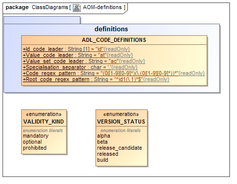
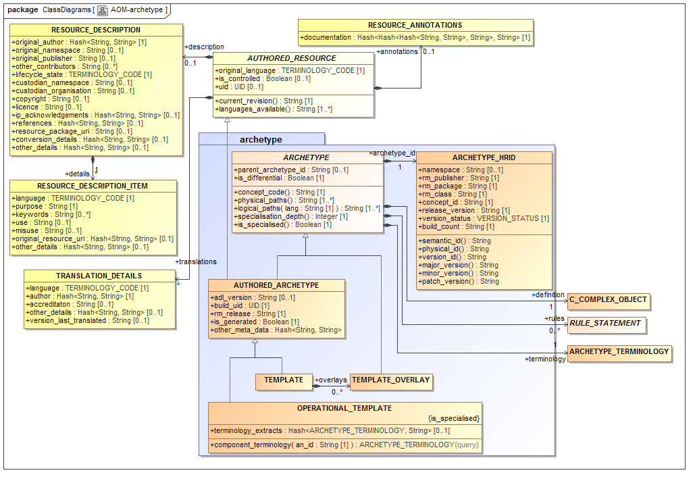
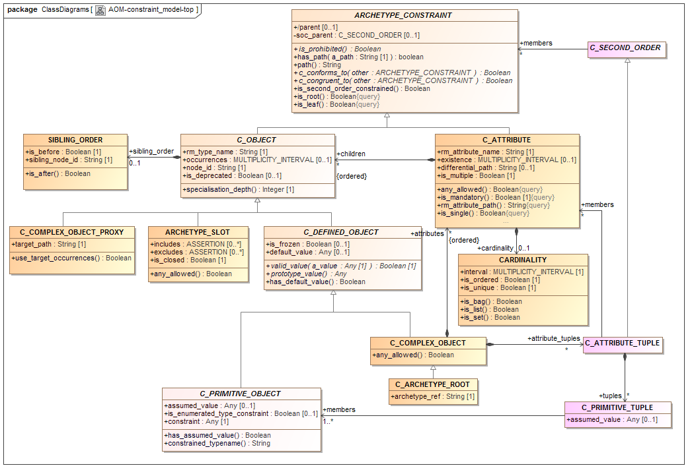
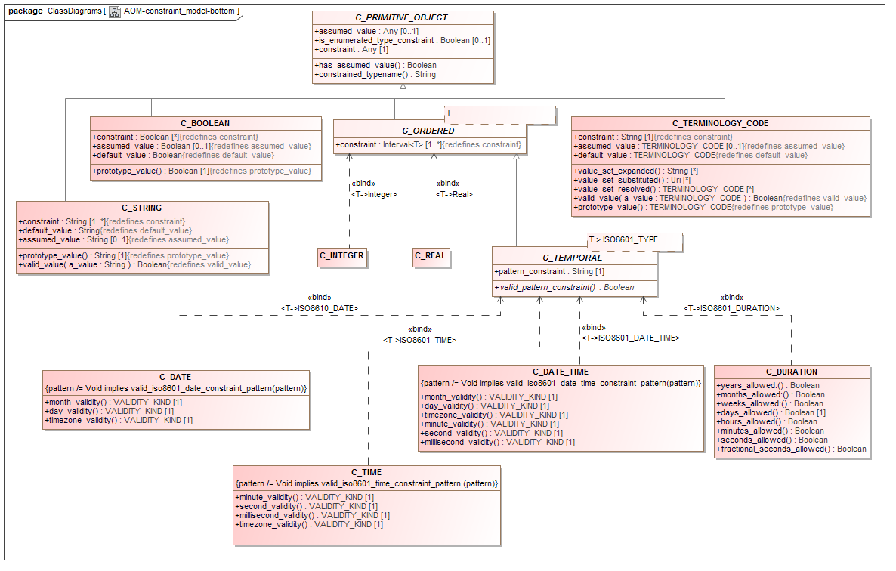
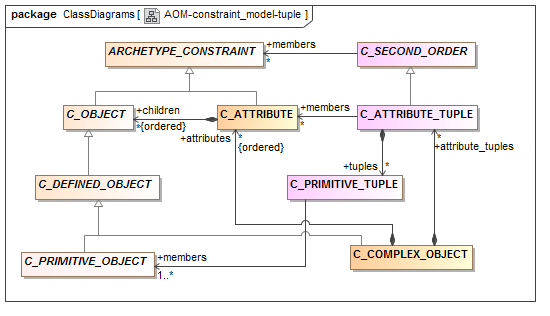
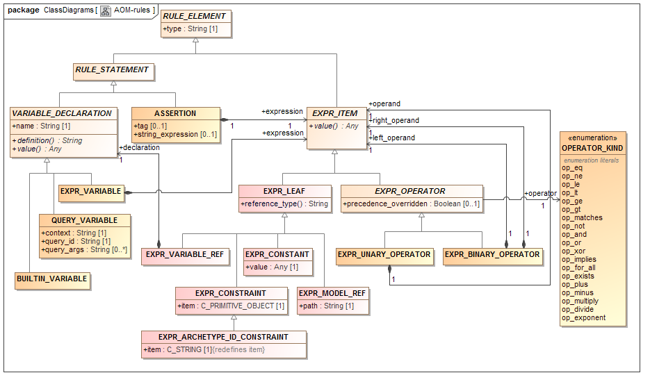
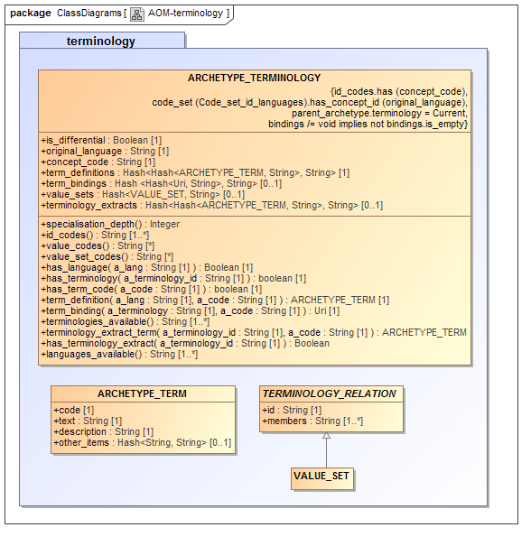

:doctype: book
:linkcss:
:toc: left
:toclevels: 4
:source-highlighter: highlightjs
:pagenums:
:numbered!:
:copyright_year: 2004
image:../images/openehr_logo_large.png["openEHR logo",align="center"]

= The openEHR Archetype Object Model (AOM2)

[cols="1,1,1"]
|===
3+^|*Issuer*: http://www.openehr.org/programs/specification/[openEHR Specification Program]

|*Revision*: <<latest_issue>>
|*Date*: <<latest_issue_date>>
|*Status*: TRIAL

3+^|*Keywords*: EHR, ADL, health records, archetypes, constraints
|===

 

include::../boilerplate/licence_block.adoc[]

== Amendment Record

[cols="1,6a,2,2", options="header"]
|===
|Issue|Details|Raiser|Completed

|[[latest_issue,2.1.14]]2.1.14
|Refactor _ARCHETYPE_ and _ARCHETYPE_TERMINOLOGY_ models, in order to simplify: remove differential and flat forms of classes. +
 Split _ARCHETYPE_ into two classes, with _AUTHORED_ARCHETYPE_ as a new class that inherits from _AUTHORED_RESOURCE_ .
|T Beale
|[[latest_issue_date,04 Jan 2015]]04 Jan 2015

|2.1.13
|Remove _VDSSR_ , _VSUNC_ ; add _VDSSID_ , _VARXID_ . Replace ‘+u’ (unstable) version modifier with semver.org standard ‘-alpha’. Remove overview material to new Archetypes: Technical Overview specification.
|T Beale, +
 I McNicoll, +
 S Garde
|12 Nov 2014

|2.1.12
|Remove _ARCHETYPE_ .uid attribute.
|H Solbrig
|08 Oct 2014

|2.1.11
|Correct spelling of ‘licence’ to international English; rename _ARCHETYPE_ . _urn_ to provenance_id.
|S Garde, +
 I McNicoll
|29 Sep 2014

|2.1.10
|Modified _C_ARCHETYPE_ROOT_ to have an id-code in all cases.
 Add error _VSONPO_ , _VSONPT_ : specialised archetype object node prohibited occurrences validity. +
 Added support for constraints on enumerated types.
|CIMI, +
 P Langford, +
 T Beale
|18 Jul 2014

|2.1.9
|Convert _ARCHETYPE_ .uid to urn: _URN_ .
|I McNicoll, +
 S Garde, +
 T Beale
|04 Jun 2014

|2.1.8
|Rename _ARCHETYPE_ .commit_number to _build_count_ .
|I McNicoll, +
 S Garde, +
 T Beale
|21 May 2014

|2.1.7
|Make _VACMCL_ a warning _WACMCL_ .
|D Moner
|07 Apr 2014

|2.1.6
|Renamed _ARCHETYPE_INTERNAL_REF_ to _C_OBJECT_PROXY_ .
|T Beale
|09 Mar 2014

|2.1.5
|Renamed ontology to terminology and simplified.
|T Beale
|09 Jan 2014

|2.1.4
|Remove _CONSTRAINT_REF_ , _C_REFERENCE_OBJECT_ types; introduce new identification system.
|T Beale +
 H Solbrig
|07 Jan 2014

|2.1.3
|Detailed Technical Review.
|H Solbrig
|21 Nov 2013

|2.1.2
|Remove _C_DOMAIN_TYPE_ ; +
 merge _C_PRIMITIVE_OBJECT_ and _C_PRIMITIVE_ ; +
 Add support for tuple constraints, replacing ADL 1.4 special Ordinal and Quantity constrainer types;
 Add new primitive type _C_TERMINOLOGY_CODE_ .
 Added _VSONIF_ , removed _VSONCI_ (dup of _VSONI_ ).
|H Solbrig +
 T Beale
|20 Aug2013

|2.1.1
|Remove _C_SINGLE_ATTRIBUTE_ and _C_MULTIPLE_ATTRIBUTE_ classes.
|T Beale, +
 S Garde, +
 S Kobayashi, +
 D Moner, +
 T Beale
|15 Dec 2011

|2.1.0
|SPEC-270. Add specialisation semantics to ADL and AOM. Add various attributes and functions to _ARCHETYPE_CONSTRAINT_ descendant classes.

* move _C_PRIMITIVE_ . _assumed_value_ to attribute slot in UML
* rename _C_DEFINED_OBJECT_ . _default_value_ function to prototype_value
* correct _assumed_value_ definition to be like ; remove its entry from all of the _C_PRIMITIVE_ subtypes
* convert _BOOLEAN_ flag representation of patterns to functions and add a String data member for the pattern value, thus matching the XSDs and ADL
* add _ARCHETYPE_ . _is_template_ attribute.
* add _ARCHETYPE_ . _is_component_ attribute.
* allow computed as well as stored attributes.
* make _ONTOLOGY_ . _terminologies_available_ computed.

|T Beale
|10 Dec 2009

|2.0.9
|SPEC-263. Change Date, Time etc classes in AOM to _ISO8601_DATE_ , _ISO8601_TIME_ etc from Support IM. +
SPEC-296. Convert _Interval<Integer>_ to _MULTIPLICITY_INTERVAL_ to simplify specification and implementation. +
SPEC-300. Archetype slot regular expressions should cover whole identifier. Added _C_STRING_ . _is_pattern_ . +
SPEC-303. Make existence, occurrences and cardinality optional in AOM. +
SPEC-308. Add validity rules to _ARCHETYPE_TERMINOLOGY_ . +
SPEC-309. _ARCHETYPE_CONSTRAINT_ adjustments. +
SPEC-178. Add template object model to AM. +

* Add _is_exhaustive_ attribute to _ARCHETYPE_SLOT_ .
* Add _is_template_ attribute to _ARCHETYPE_ .
* Add _terminology_extracts_ to _ARCHETYPE_TERMINOLOGY_ .

|T Beale +
 T Beale +
 A Flinton +
 S Heard +
 T Beale +
 T Beale +
 T Beale
|20 Jul 2009

4+^|*R E L E A S E{nbsp}{nbsp}{nbsp}{nbsp}{nbsp}1.0.2*
{set:cellbgcolor:aqua}

|2.0.2
{set:cellbgcolor!}
|SPEC-257. Correct minor typos and clarify text. Correct reversed definitions of _is_bag_ and _is_set_ in _CARDINALITY_ class.
 SPEC-251. Allow both pattern and interval constraint on Duration in Archetypes. Add pattern attribute to _C_DURATION_ class.
|C Ma, +
 R Chen, +
 T Cook +
 S Heard
|20 Nov 2008

4+^|*R E L E A S E{nbsp}{nbsp}{nbsp}{nbsp}{nbsp}1.0.1*
{set:cellbgcolor:aqua}

|2.0.1
{set:cellbgcolor!}
|CR-000200. Correct Release 1.0 typographical errors. Table for missed class _ASSERTION_VARIABLE_ added. Assumed_value assertions corrected; _standard_representation_ function corrected. Added missed _adl_version_ , _concept_ rename from CR-000153. +
 CR-000216: Allow mixture of W, D etc in ISO8601 Duration (deviation from standard). +
 CR-000219: Use constants instead of literals to refer to terminology in RM. +
 CR-000232. Relax validity invariant on _CONSTRAINT_REF_ . +
 CR-000233: Define semantics for _occurrences_ on _ARCHETYPE_INTERNAL_REF_ . +
 CR-000234: Correct functional semantics of AOM constraint model package. +
 CR-000245: Allow term bindings to paths in archetypes.
|D Lloyd, +
 P Pazos, +
 R Chen, +
 C Ma +
 S Heard +
 R Chen +
 R Chen +
 K Atalag +
 T Beale +
 S Heard
|20 Mar 2007

4+^|*R E L E A S E{nbsp}{nbsp}{nbsp}{nbsp}{nbsp}1.0*
{set:cellbgcolor:aqua}

|2.0
{set:cellbgcolor!}
|CR-000153. Synchronise ADL and AOM attribute naming.
 CR-000178. Add Template Object Model to AM. Text changes only.
 CR-000167. Add _AUTHORED_RESOURCE_ class. Remove _description_ package to _resource_ package in Common IM.
|T Beale +
 T Beale +
 T Beale
|10 Nov 2005

4+^|*R E L E A S E{nbsp}{nbsp}{nbsp}{nbsp}{nbsp}0.96*
{set:cellbgcolor:aqua}

|0.6
{set:cellbgcolor!}
|CR-000134. Correct numerous documentation errors in AOM. Including cut and paste error in _TRANSLATION_DETAILS_ class in _Archetype_ package. Corrected hyperlinks in Section 2.3. +
 CR-000142. Update ADL grammar to support assumed values. Changed _C_PRIMITIVE_ and _C_DOMAIN_TYPE_ . +
 CR-000146: Alterations to _am.archetype.description_ from CEN MetaKnow +
 CR-000138. Archetype-level assertions. +
 CR-000157. Fix names of _OPERATOR_KIND_ class attributes
|D Lloyd
S Heard, +
 T Beale
 D Kalra
 T Beale
 T Beale
|20 Jun 2005

4+^|*R E L E A S E{nbsp}{nbsp}{nbsp}{nbsp}{nbsp}0.95*
{set:cellbgcolor:aqua}

|0.5.1
{set:cellbgcolor!}
|Corrected documentation error - return type of _ARCHETYPE_CONSTRAINT_ . _has_path_ + 
add optionality markers to Primitive types UML diagram. +
Removed erroneous aggregation marker from _ARCHETYPE_ONTOLOGY_ . _parent_archetype_ and _ARCHETYPE_DESCRIPTION_ . _parent_archetype_ .
|D Lloyd
|20 Jan 2005

|0.5
|CR-000110. Update ADL document and create AOM document. +
Includes detailed input and review from:

* DSTC
* CHIME, Uuniversity College London
* Ocean Informatics

Initial Writing. Taken from ADL document 1.2draft B.
|T Beale +
 A Goodchild +
 Z Tun +
 T Austin +
 D Kalra +
 N Lea +
 D Lloyd +
 S Heard +
 T Beale
|10 Nov 2004
|===

== Trademarks

'openEHR' is a trademark of the openEHR Foundation
'Microsoft' is a trademark of the Microsoft Corporation

== Acknowledgements

The work reported in this document was funded by:

* Ocean Informatics;
* University College London (UCL), Centre for Health Informatics and Multi-professional Education (CHIME).

This specification and its sibling Archetype Definition Language specification have benefited from wide formal and informal input from the openEHR and wider health informatics community. The openEHR Foundation would like to recognise the following people and institutions.

* Koray Atalag, MD, PhD, Sen. Researcher, National Institute for Health Innovation (NIHI), New Zealand
* Linda Bird PhD, IHTSDO
* Diego Boscá, IBIME, Technical University Valencia, VeraTech for Health, Spain
* Rong Chen MD, PhD, Cambio Healthcare Systems, Sweden
* Borut Fabjan, Program Manager, Marand, Slovenia
* Sebastian Garde PhD, Ocean Informatics UK
* Peter Gummer, Ocean Informatics
* Sam Heard MD, Ocean Informatics
* Stan Huff MD, Intermountain Healthcare, UT, USA
* Dipak Kalra MD, PhD, Professor Health Informatics, UCL, president Eurorec
* Shinji Kobayashi PhD, Kyoto University EHR research unit
* Bostjan Lah, Architect, Marand, Slovenia
* Ian McNicoll MD, Ocean Informatics UK
* David Moner, IBIME, Technical University Valencia, VeraTech for Health, Spain
* Pablo Pazos Gutierrez, Tarmac IT, CaboLabs, Uruguay
* Harold Solbrig, Mayo Clinic, Rochester, USA
* Erik Sundvall PhD, Linkoping University, Sweden
* Alessandro Torrisi, Code24, The Netherlands.

:numbered:
== Introduction

Purpose
~~~~~~~

This document contains the definitive formal statement of archetype and template semantics, in the form of an object model for archetypes. The model presented here can be used as a basis for building software that represents archetypes and templates, independent of their persistent representation; equally, it can be used to develop the output side of parsers that process archetypes in a linguistic format, such as the openEHR Archetype Definition Language (ADL) link:AOM2.htm#50487307_43585[See Heard S, Beale T. Archetype Definitions and Principles. See http://www.openehr.org/repositories/spec-dev/latest/publishing/architecture/archetypes/principles/REV_HIST.html.], XML-instance and so on. As a specification, it can be treated as an API for archetypes within software tools and components.

It is recommended that the openEHR ADL document link:AOM2.htm#50487307_43585[See Heard S, Beale T. Archetype Definitions and Principles. See http://www.openehr.org/repositories/spec-dev/latest/publishing/architecture/archetypes/principles/REV_HIST.html.] be read in conjunction with this document, since it contains a detailed explanation of the semantics of archetypes, and many of the examples are more obvious in ADL, regardless of whether ADL is actually used with the object model presented here or not.

The release of AOM described in this specification corresponds to the 2.x versions of the archetype formalism.

Related Documents
~~~~~~~~~~~~~~~~~

Prerequisite documents for reading this document include:

* The _http://www.openehr.org/releases/1.0.2/architecture/overview.pdf[openEHR Architecture Overview]_

Related documents include:

* The openEHR Archetypes: Technical Overview specification
* The openEHR _http://www.openehr.org/releases/trunk/architecture/am/adl2.pdf[Archetype Definition Language (ADL)]_
* The openEHR Operational Template Specification

Nomenclature
~~~~~~~~~~~~

In this document, the term ‘attribute’ denotes any stored property of a type defined in an object model, including primitive attributes and any kind of relationship such as an association or aggregation. XML ‘attributes’ are always referred to explicitly as ‘XML attributes’.

We also use the word ‘archetype’ in a broad sense to designate what are commonly understood to be ‘archetypes’ (specifications of clinical data groups / data constraints) and ‘templates’ (data sets based on archetypes, since at a technical level, an ADL/AOM 2 template is in fact just an archetype. Accordingly, statements about ‘archetypes’ in this specification can be always understood to also apply to templates, unless otherwise indicated.

Status
~~~~~~

This specification is in the ‘development’ state, and is published for review purposes.

The development version of this document can be found at _http://www.openehr.org/releases/trunk/architecture/am/aom2.pdf_ .

Blue text indicates sections under active development.

Tools
~~~~~

Various tools exist for creating and processing archetypes. The openEHR tools are available in source and binary form from the website ( _http://www.openEHR.org_ ).

Changes from Previous Versions
~~~~~~~~~~~~~~~~~~~~~~~~~~~~~~

Release 1.5 to 2.0 (Document version 2.1.2 - )
^^^^^^^^^^^^^^^^^^^^^^^^^^^^^^^^^^^^^^^^^^^^^^

The changes in release 2 of the ADL/AOM formalism are designed to make the formalism more computable with respect to terminology, and enable more rigorous validation and flattening operations.

The changes are as follows.

* Introduction of new archetype internal coding scheme, consisting of id-codes, at-codes and ac-codes;
* Replace string archetype identifier with multi-part, namespaced identifier;
* Addition of explicit value-sets in terminology section, replacing in-line value sets in the definition section;
* Renaming archetype ontology section to ‘terminology’;
* Expression of all external term bindings as URIs following IHTSDO format;
* Introduction of generic ‘tuple’ second order constraints to replace openEHR custom constrainer types for covarying attributes within Quantity, Ordinal structures;
* Re-engineering of all primitive constrainer types, i.e. _C_STRING_ , _C_DATE_ etc;
* Removal of the openEHR Archetype Profile specification;

Release 1.4 to 1.5 (Document version 2.0 to 2.1.1)
^^^^^^^^^^^^^^^^^^^^^^^^^^^^^^^^^^^^^^^^^^^^^^^^^^

The changes in release 1.5 are made to better facilitate the representation of specialised archetypes. The key semantic capability for specialised archetypes is to be able to support a differential representation, i.e. to express a specialised archetype only in terms of the changed or new elements in its defnition, rather than including a copy of unchanged elements. Doing the latter is clearly unsustainable in terms of change management.

The changes are as follows.

* Full specialisation support: the addition of an attribute to the _C_ATTRIBUTE_ class, allowing the inclusion of a path that enables specialised archetype redefinitions deep within a structure;
* Addition of node-level annotations;
* Structural simplification of archetype ontology section;
* The name of the invariant section has been changed to rules, to better reflect its purpose.
* A template is now just an archetype.

Release 0.6 to 1.4
^^^^^^^^^^^^^^^^^^

Changes made from Release 1.3 to 1.4:

* added a new attribute _adl_version_ : String to the _ARCHETYPE_ class;
* changed name of _ARCHETYPE_ . _concept_code_ attribute to _concept_ .

== Model Overview

The model described here is a pure object-oriented model that can be used with archetype parsers and software that manipulates archetypes and templates. It is independent of any particular serialised expression of an archetype, such as ADL or XML, and can therefore be used with any kind of parser.

It is dependent on the openEHR Support model (assumed types and identifiers), as small number of the openEHR Data types IM, and the _AUTHORED_RESOURCE_ classes from the openEHR Common IM.

Package Structure
~~~~~~~~~~~~~~~~~

The openEHR Archetype Object Model is defined as the package _am.archetype_ , as illustrated in link:main.htm#50487297_46554[See openehr.am.archetype Package]. It is shown in the context of the openEHR _am.archetype_ packages.

Support Package
---------------

Overview
~~~~~~~~

The _am.support_ package contains a number of classes providing definitions used elsewhere in the archetype object model, and is illustrated below.

Utility Classes
^^^^^^^^^^^^^^^

The enumeration class, _VALIDITY_KIND_ is provided in order to define standard values representing ‘mandatory’, ‘optional’, or ‘disallowed’ in any model. It is used in this model in classes such as _C_Date_ , _C_Time_ and _C_Date_Time_ .

ADL_CODE_DEFINITIONS Class

Class Definitions
~~~~~~~~~~~~~~~~~

include::./classes/version_status.adoc[]
include::./classes/validity_kind.adoc[]
include::./classes/adl_code_definitions.adoc[]

The Archetype Package
---------------------

Overview
~~~~~~~~

The top-level model of archetypes and templates (all variant forms) is illustrated in link:archetype_package.htm#50487321_69918[See openehr.am.archetype Package - Overview]. The model defines a standard structural representation of an archetype, typically parsed from either the openEHR ADL format, or an ‘object graph’ serialisation in a format such as ODIN, XML, JSON or YAML. Archetypes authored as independent entities are instances of the class _AUTHORED_ARCHETYPE_ which is a descendant of the classes _AUTHORED_RESOURCE_ and _ARCHETYPE_ . The former provides a standardised model of descriptive meta-data, language information, annotations and revision history. The latter class defines the core structure of any kind of archetype, including namely definition, optional rules part, and terminology, along with its ‘semantic identifier’.

The _AUTHORED_ARCHETYPE_ class adds identifying attributes and flags of its own, and is the ancestor type for two further specialisations - _TEMPLATE_ and _OPERATIONAL_TEMPLATE_ . The _TEMPLATE_ class defines the notion of a ‘templated’ archetype, i.e. an archetype containing fillers/references ( _use_archetype_ constructs), typically designed to express a data set. To enable this, it may contain ‘overlays’, private archetypes that specialise one or more of the referenced / filler archetypes it uses. Overlays are represented by the _TEMPLATE_OVERLAY_ class, have no meta-data of their own, but are otherwise computationally just like any other archetype. The _OPERATIONAL_TEMPLATE_ class represents the fully flattened form of a template, i.e. with all fillers and references substituted and overlays processed, to form what is in practical terms, a single custom-made ‘operational’ artefact, ready for transformation to downstream artefacts. Because an operational template includes one or more other archetype structures inline, it also includes their terminologies, enabling it to be treated as a self-standing artefact.

Archteype Identification
~~~~~~~~~~~~~~~~~~~~~~~~

Human-Readable Identifier (HRID)
^^^^^^^^^^^^^^^^^^^^^^^^^^^^^^^^

All archetype variants based on _ARCHETYPE_BASE_ have a human-readable, structured identifier defined by the _ARCHETYPE_HRID_ class. This identifier places the artefact in a multi-dimensional space based on a namespace, its reference model class and its informational concept. This class defines an atomised representation of the identifier, enabling variant forms to be used as needed. Its various parts can be understood from the following diagram, which also shows the computed semantic_id and physical_id forms.

For specialised archetypes, the parent_archetype_id is also required. This is simply a string reference to an archetype, and should normally only use the ‘interface’ variant of the id, i.e. down to the major version only (but could technically include the minor and patch version numbers as well).

An important aspect of identification relates to the rules governing when when the HRID namespace changes or is retained, with respect to when ‘moves’ or ‘forks’ occur. Its value is always the same as one of the _original_namespace_ and _custodian_namespace_ properties inherited from _AUTHORED_RESOURCE_ . _description_ (or both, in the case where they are the same). A full explanation of the identification system and rules is given in the openEHR Knowledge Artefact Identification specification.

image:diagrams/archetype_hrid_structure.png[image]

Machine Identifiers
^^^^^^^^^^^^^^^^^^^

Two machine identifiers are defined for archetypes. The _ARCHETYPE_ . _uid_ attribute defines a machine identifier equivalent to the human readable _archetype_id_ . _semantic_id_ , i.e. _ARCHETYPE_HRID_ up to its major version, and changes whenever the latter does. It is defined as optional but to be practically useful would need to be mandatory for all archetypes within a custodian organisation where this identifier was in use. It could in principle be synthesised at any time for a custodian that decided to implement it.

The _ARCHETYPE_ . _build_uid_ attribute is also optional, and if used, is intended to provide a unique identifier that corresponds to any change in version of the artefact. At a minimum, this means generating a new UID for each change to:

* _ARCHETYPE_ . _archetype_id_ . _release_version_ ;
* _ARCHETYPE_ . _archetype_id_ . _build_count_ ;
* _ARCHETYPE_ . _description.lifecycle_state._

For every change made to an archetype inside a controlled repository (for example, addition or update of meta-data fields), this field should be updated with a new GUID value, generated in the normal way.

Top-level Meta-data
~~~~~~~~~~~~~~~~~~~

The following items correspond to syntax elements that may appear in parentheses in the first line of an ADL archetype.

ADL Version
^^^^^^^^^^^

The _ARCHETYPE._ _adl_version_ attribute in ADL 1.4 was used to indicate the ADL release used in the archetypesource file from which the AOM structure was created (the version number comes from the revision history of the openEHR ADL specification). In the current and future AOM and ADL specifications, the meaning of this attribute is generalised to mean ‘the version of the archetype formalism’ in which the current archetype is expressed. For reasons of convenience, the version number is still taken from the ADL specification, but now refers to all archetype-related specifications together, since they are always updated in a synchronised fashion.

Reference Model Release
^^^^^^^^^^^^^^^^^^^^^^^

The _ARCHETYPE._ rm_release attribute designates the release of the reference model on which the archetype is based, in the archetype’s current version. This means rm_release can change with new versions of the archetype, where re-versioning includes upgrading the archetype to a later RM release. However, such upgrading still has to obey the basic rule of archetype compatibility: later minor, patch versions and builds cannot create data that is not valid with respect to the prior version.

This should be in the same semver.org 3-part form as the _ARCHETYPE_HRID_ .release_version property, e.g. “1.0.2”. This property does not indicate conformance to any particular reference model version(s) other than the named one, since most archetypes can easily conform to more than one. More minimal archetypes are likely to technically conform to more old and future releases than more complex archteypes.

Generated Flag
^^^^^^^^^^^^^^

The _ARCHETYPE._ is_generated flag is used to indicate that an archetype has been machine-generated from another artefact, e.g. an older ADL version (say 1.4), or a non-archetype artefact. If true, it indicates to tools that the current archetype can potentially be overwritten, and that some other artefact is considered the primary source. If manual authoring occurs, this attribute should be set to False.

=== Governance Meta-data

Various meta-data elements are inherited from the _AUTHORED_RESOURCE_ class, and provide the natural language description of the archetype, authoring and translation details, use, misuse, keywords and so on. There are three distinct parts of the meta-data: governance, authorship, and descriptive details.

==== Governance Meta-data Items

Governance meta-data is visible primarily in the _RESOURCE_DESCRIPTION_ class, inherited via _AUTHORED_RESOURCE_ , and consists of items relating to management and intellectual property status of the artefact. A typical form of these is shown in the screenshot in Figure <<metadata_governance>>.

[[metadata_governance]]
.Governance Meta-data

Package
+++++++

The optional _resource_package_uri_ property enables the recording of a reference to a package of archetypes or other resources, to which this archetype is considered to below. It may be in the form of ‘text <URL>’.

Lifecycle_state
+++++++++++++++

The description.lifecycle_state is an important property of an archetype, which is used to record its state in a defined lifecycle. The lifecycle state machine and versioning rules are explained fully in the openEHR Knowledge Artefact Identification specification. Here we simply note that the value of the property is a coded termcorresponding to one of the macro-state names on the diagram, i.e. ‘unmanaged’, ‘in_development’, and so on.

Original_namespace and Original_publisher
+++++++++++++++++++++++++++++++++++++++++

These two optional properties indicate the original publishing organisation, and its namespace, i.e. the original publishing environment where the artefact was first imported or created. The _original_namespace_ property is normally the same value as _archetype_id.namespace_ , unless the artefact has been forked into its current custodian, in which case _archetype_id.namespace_ will be the same as _custodian_namespace_ .

Custodian_namespace and Custodian_organisation
++++++++++++++++++++++++++++++++++++++++++++++

These two optional properties state a formal namespace, and a human-readable organisation identifier corresponding to the current custodian, i.e. maintainer and publisherof the artefact, if there is one.

Intellectual Property Items
+++++++++++++++++++++++++++

There are three properties in the class that _RESOURCE_DESCRIPTION_ relate to intellectual property (IP). Licence is a String field for recording of the licence (US: ‘license’) under which the artefact can be used. The recommended format is ‘licence name <reliable URL to licence statement>’.

The copyright property records the copyright applying to the artefact, and is normally in the standard form ‘(c) name’ or ‘(c) year name’. The special character © may also be used (UTF-8 0xC2A9).

Authorship Meta-data
^^^^^^^^^^^^^^^^^^^^

Authorship meta-data consists of items such as author name, contributors, and translator information, and is visualised in Figure <<metadata_authoring>>.

[[metadata_authoring]]
.Authoring Meta-data

Original Author
+++++++++++++++

The _RESOURCE_DESCRIPTION_ .original_author property defines a simple list of name/value pairs via which the original author can be documented. Typical key values include ‘name’, ‘organi[zs]ation’, ‘email’ and ‘date’.

Contributors
++++++++++++

The _RESOURCE_DESCRIPTION_ .other_contributors property is a simple list of strings, one for each contributor. The recommended format of the string is one of:

* ‘first names last name, organisation’
* ‘first names last name, organisation <contributor email address>’
* ‘first names last name, organisation <organisation email address>’

Languages and Translation
+++++++++++++++++++++++++

The _AUTHORED_RESOURCE_ . _original_language_ and _TRANSLATION_DETAILS_ class enable the original language of authoring and information relating to subsequent translations to be expressed. _TRANSLATION_DETAILS_ . _author_ allows each translator to be represented in the same way as the _original_author_ , i.e. a list of name/values. The _version_last_translated_ property is used to record a copy of the archetype_id.physical_id for each language, when the translation was carried out. This enables maintainers to know when new translations are needed for some or all languages.

Version_last_translated
+++++++++++++++++++++++

This String property records the full version identifier (i.e. _ARCHETYPE_ .archetype_id.version_id) at the time of last translation, enabling tools to determine if and when translations may be out of date.

Descriptive Meta-data
^^^^^^^^^^^^^^^^^^^^^

Various descriptive meta-data may be provided for an archetype in multiple translations in the _RESOURCE_DESCRIPTION_ITEM_ class, using one instance for each translation language, as shown in link:archetype_package.htm#50487321_21245[See Descriptive meta-data].

image:images/metadata_details.png[image]

Purpose
+++++++

The _purpose_ itemis a String property for recording the intended design concept of the artefact.

Use and Misuse
++++++++++++++

The _use_ and _misuse_ properties enable specific uses and misuses to be documented. The latter normally relate to common errors of use, or apparently reasonable but wrong assumptions about use.

Keywords
++++++++

The _keywords_ property is a list of Strings designed to record search keywords for the artefact.

Resources
+++++++++

The original_resource_uri property is used to record one or more references to resources in each particular language.

1.  this property does not appear to have ever been used, and it may not be useful, since ‘resources’ are not typically available for each language.

Structural Definition
~~~~~~~~~~~~~~~~~~~~~

Common Structural Parts
^^^^^^^^^^^^^^^^^^^^^^^

The archetype definition is the main definitional part of an archetype and is an instance of a _C_COMPLEX_OBJECT_ . This means that the root of the constraint structure of an archetype always takes the form of a constraint on a non-primitive object type.

The terminology section of an archetype is represented by its own classes, and is what allows archetypes to be natural language- and terminology-neutral. It is described in detail in the link:AOM2.htm#50487311_20568[See Terminology Package].

An archetype may include one or more rules. Rules are statements expressed in a subset of predicate logic, which can be used to state constraints on multiple parts of an object. They are not needed to constrain single attributes or objects (since this can be done with an appopriate _C_ATTRIBUTE_ or _C_OBJECT_ ), but are necessary for constraints referring to more than one attribute, such as a constraint that ‘systolic pressure should be >= diastolic pressure’ in a blood pressure measurement archetype. They can also be used to declare variables, including external data query results, and make other constraints dependent on a variable value, e.g. the gender of the record subject.

Lastly, annotations and revision history sections, inherited from the _AUTHORED_RESOURCE_ class, can be included as required. The annotations section is of particular relevance to archetypes and templates, and is used to document individual nodes within an archetype or template, and/or nodes in reference model data, that may not be constrained in the archetype, but whose specific use in the archetyped data needs to be documented. In the former case, the annotations are keyed by an archetype path, while in the latter case, by a reference model path.

Structural Variants
^^^^^^^^^^^^^^^^^^^

The model in link:archetype_package.htm#50487321_69918[See openehr.am.archetype Package - Overview] defines the structures of a number of variants of the ‘archetype’ idea. All concrete instances are instances of one of the concrete descendants of _ARCHETYPE_ . link:archetype_package.htm#50487321_17970[See Source archetype instance structure] illustrates the typical object structure of a source archetype - the form of archetype created by an authoring tool - represented by a _DIFFERENTIAL_ARCHETYPE_ instance. Mandatory parts are shown in bold.

Source archetypes can be specialised, in which case their definition structure is a partial overlay on the flat parent, or ‘top-level’, in which case the definition structure is complete. _C_ARCHETYPE_ROOT_ instances may only occur representing direct references to other archetypes - ‘external references’.

A flat archetype is generated from one or more source archetypes via the flattening process described in the next chapter of this specification, (also in the ADL specification). This generates a _FLAT_ARCHETYPE_ from a _DIFFERENTIAL_ARCHETYPE_ instance. The main two changes that occur in this operation are a) specialised archetype overlays are applied to the flat parent structure, resulting in a full archetype structure, and b) internal references (use_nodes) are replaced by their expanded form, i.e. a copy of the subtrees to which they point.

This form is used to represent the full ‘operational’ structure of a specialised archetype, and has two uses. The first is to generate backwards compatible ADL 1.4 legacy archetypes (always in flat form); the second is during the template flattening process, when the flat forms of all referenced archetypes and templates are ultimately combined into a single operational template.

For either immediate descendant of the _ARCHETYPE_ class, if the property _is_template_ = True, the structure is a template.

link:archetype_package.htm#50487321_73595[See Source template instance structures] illustrates the structure of a source template, i.e instances of _DIFFERENTIAL_ARCHETYPE_ class with _is_template_ = True. A source template is an archetype containing _C_ARCHETYPE_ROOT_ objects representing slot fillers - each referring to an external archetype or template, or potentially an overlay archetype.

Another archetype variant, also shown in link:archetype_package.htm#50487321_73595[See Source template instance structures] is the template overlay, i.e. _DIFFERENTIAL_ARCHETYPE_ instances with _is_template, is_overlay_ and _is_specialised_ all set to True. These are purely local components of templates, and include only the definition and terminology. The definition structure is always a specialised overlay on something else, and may not contain any slot fillers or external references, i.e. no _C_ARCHETYPE_ROOT_ objects. No identifier, adl_version, languages or description are required, as they are considered to be propagated from the owning root template. Accordingly, template overlays act like a simplified specialised archetype. Template overlays can be thought of as being similar to ‘anonymous’ or ‘inner’ classes in some object-oriented programming languages. (There is no technical reason why overlay archetypes, i.e. is_template = False, could not also exist, but as yet there seems no obvious practical use).

link:archetype_package.htm#50487321_49083[See Operational template instance structure] illustrates the resulting operational template, or compiled form of a template. This is created by building the composition of referenced archetypes and/or templates and/or template overlays, in their flattened form, to generate a single ‘giant’ archetype. The root node of this archetype, along with every archetype/template root node within, is represented using a _C_ARCHETYPE_ROOT_ object. An operational template also has a component_terminologies property containing the ontologies from every constituent archetype, template and overlay.

More details of template development, representation and semantics are described in the next section.

Class Descriptions
~~~~~~~~~~~~~~~~~~

include::./classes/archetype.adoc[]
include::./classes/authored_archetype.adoc[]
include::./classes/archetype_hrid.adoc[]
include::./classes/template.adoc[]
include::./classes/template_overlay.adoc[]
include::./classes/operational_template.adoc[]

Validity Rules
~~~~~~~~~~~~~~

The following validity rules apply to all varieties of _ARCHETYPE_ object:

VARAV: ADL version validity. The adl_version top-level meta-data item must exist and consist of a valid 3-part version identifier.

VARRV: RM release validity. The rm_release top-level meta-data item must exist and consist of a valid 3-part version identifier.

VARCN: archetype concept validity. The node_id of the root object of the archetype must be of the form id1\{.1}*, where the number of ‘.1’ components equals the specalisation depth, and must be defined in the terminology.

VATDF: value code validity. Each value code (at-code) used in a term constraint in the archetype definition must be defined in the term_definitions part of the terminology of the flattened form of the current archetype.

VACDF: constraint code validity. Each value set code (ac-code) used in a term constraint in the archetype definition must be defined in the term_definitions part of the terminology of the current archetype.

VATDA: value set assumed value code validity. Each value code (at-code) used as an assumed_value for a value set in a term constraint in the archetype definition must exist in the value set definition in the terminology for the identified value set.

VETDF: external term validity. Each external term used within the archetype definition must exist in the relevant terminology (subject to tool accesibility; codes for inaccessible terminologies should be flagged with a warning indicating that no verification was possible).

VOTM: terminology translations validity. Translations must exist for term_definitions and constraint_definitions sections for all languages defined in the description / translations section.

VOKU: object key unique. Within any keyed list in an archetype, including the desription, terminology, and annotations sections, each item must have a unique key with respect to its siblings.

VARDT: archetype definition typename validity. The typename mentioned in the outer block of the archetype definition section must match the type mentioned in the first segment of the archetype id.

VRANP: annotation path valid. Each path mentioned in an annotation within the annotations section must either be a valid archetype path, or a ‘reference model’ path, i.e. a path that is valid for the root class of the archetype.

VRRLP: rule path valid. Each path mentioned in a rule in the rules section must be found within the archetype, or be an RM-valid extension of a path found within the archetype.

The following validity rules apply to _ARCHETYPE_ objects for which _is_overlay_ = False:

VARID: archetype identifier validity. The archetype must have an identifier that conforms to the openEHR specification for archetype identifiers.

VDEOL: original language specified. An original_language section containing the meta-data of the original authoring language must exist.

VARD: description specified. A description section containing the main meta-data of the archetype must exist.

The following rules apply to specialised archetypes.

VASID: archetype specialisation parent identifier validity. The archetype identifier stated in the specialise clause must be the identifier of the immediate specialisation parent archetype.

VALC: archetype language conformance. The languages defined in a specialised archetype must be the same as or a subset of those defined in the flat parent.

VACSD: archetype concept specialisation depth. The specialisation depth of the concept code must be one greater than the specialisation depth of the parent archetype.

VATCD: archetype code specialisation level validity. Each archetype term (‘at’ code) and constraint code (‘ac’ code) used in the archetype definition part must have a specialisation level no greater than the specialisation level of the archetype.

 

Constraint Model Package
------------------------

Overview
~~~~~~~~

link:constraint_model_package.htm#50487317_31763[See openehr.am.archetype.constraint_model Package] and link:constraint_model_package.htm#50487317_64069[See The openehr.am.archetype.primitive Package] illustrate the object model of constraints used in an archetype definition. This model is completely generic, and is designed to express the semantics of constraints on instances of classes which are themselves described in any orthodox object-oriented formalism, such as UML. Accordingly, the major abstractions in this model correspond to major abstractions in object-oriented formalisms, including several variations of the notion of ‘object’ and the notion of ‘attribute’. The notion of ‘object’ rather than ‘class’ or ‘type’ is used because archetypes are about constraints on data (i.e. ‘instances’, or ‘objects’) rather than models, which are constructed from ‘classes’. In this document, the word ‘attribute’ refers to any data property of a class, regardless of whether regarded as a ‘relationship’ (i.e. association, aggregation, or composition) or ‘primitive’ (i.e. value) attribute in an object model.

The definition part of an archetype is an instance of a _C_COMPLEX_OBJECT_ and consists of alternate layers of object and attribute constrainer nodes, each containing the next level of nodes. At the leaves are primitive object constrainer nodes constraining primitive types such as _String_ , _Integer_ etc. There are also nodes that represent internal references to other nodes, constraint reference nodes that refer to a text constraint in the constraint binding part of the archetype terminology, and archetype constraint nodes, which represent constraints on other archetypes allowed to appear at a given point. The full list of concrete node types is as follows:

* _C_COMPLEX_OBJECT_ : any interior node representing a constraint on instances of some non-primitive type, e.g. _OBSERVATION_ , _SECTION_ ;
* _C_ATTRIBUTE_ : a node representing a constraint on an attribute (i.e. UML ‘relationship’ or ‘primitive attribute’) in an object type;
* _C_PRIMITIVE_OBJECT_ : an node representing a constraint on a primitive (built-in) object type;
* _C_COMPLEX_OBJECT_PROXY_ : a node that refers to a previously defined _C_COMPLEX_OBJECT_ node in the same archetype. The reference is made using a path;
* _ARCHETYPE_SLOT_ : a node whose statements define a constraint that determines which other archetypes can appear at that point in the current archetype. It can be thought of like a keyhole, into which few or many keys might fit, depending on how specific its shape is. Logically it has the same semantics as a _C_COMPLEX_OBJECT_ , except that the constraints are expressed in another archetype, not the current one.
* _C_ARCHETYPE_ROOT_ : stands for the root node of an archetype; enables another archetype to be referenced from the present one. Used in both archetypes and templates.

The constraints define which configurations of reference model class instances are considered to conform to the archetype. For example, certain configurations of the classes _PARTY_ , _ADDRESS_ , _CLUSTER_ and _ELEMENT_ might be defined by a Person archetype as allowable structures for ‘people with identity, contacts, and addresses’. Because the constraints allow optionality, cardinality and other choices, a given archetype usually corresponds to a set of similar configurations of objects.

The type-name nomenclature _C_XXX_ used here is intended to be read as “constraint on objects of type _XXXX_ ”, i.e. a _C_COMPLEX_OBJECT_ is a “constraint on a complex object (defined by a complex reference model type)”. These type names are used below in the formal model.

Semantics
~~~~~~~~~

The effect of the model is to create archetype description structures that are a hierarchical alternation of object and attribute constraints. This structure can be seen by inspecting an ADL archetype, or by viewing an archetype in the openEHR ADL workbench link:AOM2.htm#50487307_29116[See openEHR. EHR Reference Model. See http://www.openehr.org/repositories/spec-dev/latest/publishing/architecture/top.html.], and is a direct consequence of the object-oriented principle that classes consist of properties, which in turn have types that are classes. (To be completely correct, types do not always correspond to classes in an object model, but it does not make any difference here). The repeated object/attribute hierarchical structure of an archetype provides the basis for using paths to reference any node in an archetype. Archetype paths follow a syntax that is a directly convertible in and out of the W3C Xpath syntax.

All Node Types
^^^^^^^^^^^^^^

Path Functions
++++++++++++++

A small number of properties are defined for all node types. The path feature computes the path to the current node from the root of the archetype, while the has_path function indicates whether a given path can be found in an archetype.

Conformance Functions
+++++++++++++++++++++

All node types include two functions that formalise the notion of conformance of a specialised archetype to a parent archetype. Both functions take an argument which must be a corresponding node in a parent archetype, not necessarily the immediate parent. A ‘corresponding’ node is one found at the same or a congruent path. A congruent path is one in which one or more at-codes have been redefined in the specialised archetype.

The _c_conforms_to_ function returns True if the node on which it is called is a valid specialisation of the ‘other’ node. The _c_congruent_to_ function returns True if the node on which it is called is the same as the other node, with the possible exception of a redefined at-code. The latter may happen due to the need to restrict the domain meaning of node to a meaning narrower than that of the same node in the parent. The formal semantics of both functions are given in the section link:AOM2.htm#50487317_85899[See Class Definitions].

Attribute Node Types
^^^^^^^^^^^^^^^^^^^^

Constraints on reference model attributes, including computed attributes (represented by functions with no aguments in most programming languages), are represented by instances of _C_ATTRIBUTE_ . The expressible constraints include:

* is_multiple: a flag that indicates whether the _C_ATTRIBUTE_ is constraining a multiply-valued (i.e. container) RM attribute or a single-valued one;
* existence: whether the corresponding instance (defined by the _rm_attribute_name_ attribute) must exist;
* child objects: representing allowable values of the object value(s) of the attribute.

In the case of single-valued attributes (such as Person.date_of_birth) the children represent one or more alternative object constraints for the attribute value.

For multiply-valued attributes (such as _Person_ . _contacts_ : __List<Contact>__), a cardinality constraint on the container can be defined. The constraint on child objects is essentially the same except that more than one of the alternatives can co-exist in the data. link:constraint_model_package.htm#50487317_49259[See Single and Multiple-valued C_ATTRIBUTEs] illustrates the two possibilities.

The appearance of both _existence_ and _cardinality_ constraints in _C_ATTRIBUTE_ deserves some explanation, especially as the meanings of these notions are often confused in object-oriented literature. An existence constraint indicates whether an object will be found in a given attribute field, while a cardinality constraint indicates what the valid membership of a container object is. _Cardinality_ is only required for container objects such as _List<T>_ , _Set<T>_ and so on, whereas _existence_ is always possible. If both are used, the meaning is as follows: the existence constraint says whether the container object will be there (at all), while the cardinality constraint says how many items must be in the container, and whether it acts logically as a list, set or bag. Both existence and cardinality are optional in the model, since they are only needed to override the settings from the reference model.

image:diagrams/c_attributes.png[image]

==== Object Node Types

===== Node_id and Paths

The node_id attribute in the class _C_OBJECT_ , inherited by all subtypes, is of key importance in the archetype constraint model. It has two functions:

* it allows archetype object constraint nodes to be individually identified, and in particular, guarantees sibling node unique identification;
* it provides a code to which a human-understanding terminology definition can be attached, as well as potentially a terminology binding.

The existence of _node_ids_ in an archetype allows archetype paths to be created, which refer to each node. Every node in the archetype needs a _node_id_ , but only node_ids for nodes under container attributes must have a terminology definition. For nodes under single-valued attributes, the terminology definition is optional (and typically not supplied), since the meaning is given by the reference model attribute definition.

===== Sibling Ordering

Within a specialised archetype, redefined or added object nodes may be defined within a container attribute. Since specialised archetypes are in differential form, i.e. only redefined or added nodes are expressed, not nodes inherited unchanged, the relative ordering of siblings can’t be stated simply by the ordering of such items within the relevant list within the differential form of the archetype. An explicit ordering indicator is required if indeed order is specific. The _C_OBJECT_ . _sibling_order_ attribute provides this possibility. It can only be set on a _C_OBJECT_ descendant within a multiply-valued attribute, i.e. an instance of _C_ATTRIBUTE_ for which the cardinality is ordered.

===== Defined Object Nodes (C_DEFINED_OBJECT)

The _C_DEFINED_OBJECT_ subtype corresponds to the category of _C_OBJECTs_ that are defined in an archetype by value, i.e. by inline definition. Four properties characterise _C_DEFINED_OBJECT_ s as follows.

===== Valid_value

The _valid_value_ function tests a reference model object for conformance to the archetype. It is designed for recursive implementation in which a call to the function at the top of the archetype definition would cause a cascade of calls down the tree. This function is the key function of an ‘archetype-enabled kernel’ component that can perform runtime data validation based on an archetype definition.

===== Prototype_value

This function is used to generate a reasonable default value of the reference object being constrained by a given node. This allows archteype-based software to build a ‘prototype’ object from an archetype which can serve as the initial version of the object being constrained, assuming it is being created new by user activity (e.g. via a GUI application). Implementation of this function will usually involve use of reflection libraries or similar.

===== Default_value

This attribute allows a user-specified default value to be defined within an archetype. The _default_value_ object must be of the same type as defined by the _prototype_value_ function, pass the _valid_value_ test. Where defined, the _prototype_value_ function would return this value instead of a synthesised value.

===== Node Deprecation

It is possible to mark an instance of any defined node type as deprecated, meaning that by preference it should not be used, and that there is an alternative solution for recording the same information. Rules or recommendations for how deprecation should be handled are outside the scope of the archetype proper, and should be provided by the governance framework under which the archetype is managed.

===== ‘Frozen’ Nodes

A node may be redefined into multiple child nodes in a specialised archetype. If the children are considered to exhaustively define the value space corresponding to the original node, the latter may be ‘frozen’, meaning no further children can be defined. This also has a runtime implication: a frozen node cannot have any instances, only its children can.

===== Complex Objects (C_COMPLEX_OBJECT)

Along with _C_ATTRIBUTE_ , _C_COMPLEX_OBJECT_ is the key structuring type of the _constraint_model_ package, and consists of attributes of type _C_ATTRIBUTE_ , which are constraints on the attributes (i.e. any property, including relationships) of the reference model type. Accordingly, each _C_ATTRIBUTE_ records the name of the constrained attribute (in _rm_attr_name)_ , the existence and cardinality expressed by the constraint (depending on whether the attribute it constrains is a multiple or single relationship), and the constraint on the object to which this _C_ATTRIBUTE_ refers via its _children_ attribute (according to its reference model) in the form of further _C_OBJECTs_ .

===== Any_allowed

The any_allowed function on a node indicates that any value permitted by the reference model for the attribute or type in question is allowed by the archetype; its use permits the logical idea of a completely “open” constraint to be simply expressed, avoiding the need for any further substructure.

===== Primitive Types (C_PRIMITIVE_OBJECT descendants)

Constraints on primitive types are defined by the classes inheriting from _C_PRIMITIVE_OBJECT_ , i.e. _C_STRING_ , _C_INTEGER_ and so on. The primitive types are represented in such a way as to accommodate both ‘tuple’ constraints and logically unary constraints, using a tuple array whose members are each a primitive constraint corresponding to each primitive type. Tuple constraints are second order constraints, described below, enable covarying constraints to be stated. In the unary case, the constraint is the first member of a tuple array.

The primitive constraint for each primitive type may itself be complex. Its type is given by the type of the constraint accessor in each _C_PRIMITIVE_OBJECT_ descendant and is summarised in the following table.

[width="100%",cols="34%,33%,33%",options="header",]
|=====================================================================================================================================================================================================================
|Primitive type |Primitive constrainer type |Explanation
|Boolean |_List <Boolean>_ |Can represent one or two Boolean values, enabling the logical constraints ‘true’, ‘false’ and ‘true or false’ to be expressed.
|String |_List <String>_ |A list of possible string values, which may include regular expressions, which are delimited by ‘/’ characters.
|Terminology_code |_String_ |A string containing either a single at-code or a single ac-code. In the latter case, the constraint represents either a locally defined value set or (via binding) an external value set.
|Ordered types |_List <Interval<T>>_ |Can represent a single value (which is a point interval), a list of values (list of point intervals), a list of intervals, which may be mixed proper and point intervals.
|Integer |_T -> Integer_ |As for Ordered type, with T = Integer
|Real |_T -> Real_ |As for Ordered type, with T = Real
|Temporal types a|
_List <Interval +
 <T->ISO8601_TYPE>>_

OR

String (pattern) __

 |As for ordered types, with T being an ISO8601-based type, with the addition of a second type constraint - a pattern based on ISO8601 syntax.,
|Date |_T -> ISO8601_DATE_ |As for Temporal types with T = _ISO8601_DATE_
|Time |_T -> ISO8601_TIME_ |As for Temporal types with T = _ISO8601_TIME_
|Date_time |_T -> ISO8601_DATE_TIME_ |As for Temporal types with T = _ISO8601_DATE_TIME_
|Duration |_T -> ISO8601_DURATION_ |As for Temporal types with T = _ISO8601_DURATION_
|=====================================================================================================================================================================================================================

===== Terminology Constraints - C_TERMINOLOGY_CODE

The _C_TERMINOLOGY_CODE_ type entails some complexity and merits further explanation. This is the only constrainer type whose constraint semantics are not self-contained, but located in the archetype terminology and/or in external terminologies.

A _C_TERMINOLOGY_CODE_ instance in an archetype is simple: it can only be one of the following constraints:

* a single ac-code, referring to either a value-set defined in the archetype terminology or bound to an external value set or ref set;
* in the first case, an additional at-code may be included as an assumed value; the at-code must come from the locally defined value set;
* a single at-code, repesenting a single possible value. In theory this could be done using an ac-code referring to a value set containing a single value, but there seems little value in this extra verbiage, and little cost in providing the single-member value set short cut.

In addition, a _C_TERMINOLOGY_CODE_ instance can reconstitute the internal value set via access to the archetype terminology (this has to be set up correctly within software). If bindings are evaluated, the external form of a value set can potentially be obtained as well. The utility of this is to be able to evaluate and cache certain external ‘ref sets’ when evaluating the Operational Template.

===== Assumed_value

The ‘assumed_value’ concept is useful for archetypes containing any optional constraint. and provides an ability to define a value that can be assumed for a data item for which no data is found at execution time.

For example, an archetype for the concept ‘blood pressure measurement’ might contain an optional protocol section containing a data point for patient position, with choices ‘lying’, ‘sitting’ and ‘standing’. Since the section is optional, data could be created according to the archetype which does not contain the protocol section. However, a blood pressure cannot be taken without the patient in some position, so clearly there is an implied value for patient position. Amongst clinicians, basic assumptions are nearly always made for such things: in general practice, the position could always safely be assumed to be “sitting” if not otherwise stated; in the hospital setting, “lying” would be the normal assumption. The assumed_value feature of archetypes allows such assumptions to be explicitly stated so that all users/systems know what value to assume when optional items are not included in the data.

Note that the notion of assumed values is distinct from that of ‘default values’. The latter notion is that of a default ‘pre-filled’ value that is provided (normally in a local context by a template) for a data item that is to be filled in by the user, but which is typically the same in many cases. Default values are thus simply an efficiency mechanism for users. As a result, default values do appear in data, while assumed values don’t.

===== Reference Objects

The types _ARCHETYPE_SLOT_ and _C_COMPLEX_OBJECT_PROXY_ are used to express, respectively, a ‘slot’ where further archetypes can be used to continue describing constraints; a reference to a part of the current archetype that expresses exactly the same constraints needed at another point.

===== Constraints on Enumeration Types

Enumeration types in the reference model are assumed to have semantics expected in UML, and mainstream programming languages, i.e. to be a distinct type based on a primitive type, normally Integer or String. Each such type consists of a set of values from the domain of its underlying type, thus, a set of Integer, String or other primitive values. Each of these values is assumed to be named in the manner of a symbolic constant. Although stricly speaking UML doesn’t require an enumerated type to be based on an underlying primitive type, programming languages do, hence the assumption here that values from the domain of such a type are involved.

A constraint on an enumerated type therefore consists of an AOM instance of a _C_PRIMITIVE_ descendant, almost always _C_INTEGER_ or _C_STRING_ . The flag _is_enumerated_type_constraint_ defined on _C_PRIMITIVE_ indicates that a given _C_PRIMITIVE_ is a constrainer for an enumerated type.

Since _C_PRIMITIVEs_ don’t have type names in ADL, the type name is inferred by any parser or compiler tool that deserialises an archetype from ADL, and stored in the _rm_type_ attribute inherited from _C_OBJECT_ . An example is shown below of a type enumeration.

A parser that deserialises from an object dump format such as ODIN, JSON or XML will not need to do this.

The form of the constraint itself is simply a series of Integer, String or other primitive values, or an equivalent range or ranges. In the above example, the ADL equivalent of the pk_percent, pk_fraction constraint on a field of type _PROPORTION_KIND_ is in fact just __\{2, 3}__, and it is visualised by lookup to show the relevant symbolic names.

=== Second Order Constraints

All of the constraint semantics described above can be considered ‘first order’ in the sense that they define how specific object/attribute/object hierarchies are defined in the instance possibility space of some part of a reference model.

Some constraints however do not fit directly within the object/attribute/object hierarchy scheme, and are considered ‘second order constraints’ in the archetype formalism. The ‘rule’ constraints (‘invariants’ in ADL/AOM 1.4) constitute one such group. These constraints are defined in terms of first order predicate logic statements that can refer to any number of constraint nodes within the main hierarchy. These are described in link:AOM2.htm#50487315_49650[See The Assertion Package].

Another type of second order constraint can be ‘attached’ to the object/attribute/object hierarchy in order to further limit structural possibilities. Although these constraints could also theoretically be expressed as rules, they are supported by direct additions to the main constraint model since they can be easily and intuitively represented ‘inline’ in ADL and corresponding AOM structures.

==== Tuple Constraints

Tuple constraints are designed to account for the very common need to constrain the values of more than one RM class attribute together. This effectively treats the attributes in question as a tuple, and the corresponding object constraints are accordingly modelled as tuples. Additions to the main constraint model to support tuples are shown below.

In this model, the type _C_ATTRIBUTE_TUPLE_ groups the co-constrained _C_ATTRIBUTE_ s under a _C_COMPLEX_OBJECT_ . Currently the concrete type is limited to being _C_PRIMITIVE_OBJECT_ , to reduce complexity, and since this caters for the known examples of tuple constraints. In principle, any _C_DEFINED_OBJECT_ would be allowed, and this may change in the future.

The tuple constraint type replaces all domain-specific constraint types defined in ADL/AOM 1.4, including _C_DV_QUANTITY_ and _C_DV_ORDINAL_ .

These additions allow standard constraint structures (i.e. _C_ATTRIBUTE_ / _C_COMPLEX_OBJECT_ / _C_PRIMITIVE_OBJECT_ hierarchies) to be ‘annotated’, while leaving the first order structure intact. The following example shows an archetype instance structure in which a notional _ORDINAL_ type is constrained. The logical requirement is to constrain a _ORDINAL_ to one of three instance possibilities, each of which consists of a pair of values for the attributes value and symbol, of type Integer and _TERMINOLOGY_CODE_ respectively. Each of these three instance constraints should be understood as an alternative for the single valued owning attribute, _ELEMENT_ .value. Tuple constraints achieve the requirement to express the constraints as pairs not just as allowable alternatives at the final leaf level, which would incorrectly allowing any mixing of the Integer and code values.

image:diagrams/tuple_example.png[image]

==== Assertions

Assertions are also used in _ARCHETYPE_SLOTs_ , in order to express the ‘included’ and ‘excluded’ archetypes for the slot. In this case, each assertion is an expression that refers to parts of other archetypes, such as its identifier (e.g. ‘include archetypes with short_concept_name matching xxxx’). Assertions are modelled here as a generic expression tree of unary prefix and binary infix operators. Examples of archetype slots in ADL syntax are given in the openEHR ADL document.

=== AOM Type Substitutions

The _C_OBJECT_ types defined in link:constraint_model_package.htm#50487317_31763[See openehr.am.archetype.constraint_model Package] are reproduced below, with concrete types that may actually occur in archetypes shown in dark yellow / non-italic.

Within a specialised archetype, nodes that redefine corresponding nodes in the parent are normally of the same _C_OBJECT_ type (we can think of this as a ‘meta-type’, since the RM type is the ‘type’ in the information model sense), but in some cases may also be of different _C_OBJECT_ types.

The rules for meta-type redefinition are as follows:

* A node of each meta-type can be redefined by a node of the same meta-type, with narrowed / added constraints;
* _ARCHETYPE_SLOT_ can be redefined by:
* one or more _C_ARCHETYPE_ROOT_ nodes taken together, considered to define a ‘filled’ version of the slot;
* an _ARCHETYPE_SLOT_ , in order to close the slot.
* A _C_ARCHETYPE_ROOT_ node can be redefined by:
* A _C_ARCHETYPE_ROOT_ , where the archetype_ref of the redefining node is a specialisation of that mentioned in the parent node.
* A terminal _C_COMPLEX_OBJECT_ node containing no constraint other than RM type, _node_id_ and possibly occurrences (i.e. having no substructure), can be redefined by a constraint of any other AOM type.

The ‘terminal _C_COMPLEX_OBJECT_ ’ can be understood as a placeholder node primarily defined for the purpose of stating meaning.

=== Class Definitions

include::./classes/archetype_constraint.adoc[]
include::./classes/c_attribute.adoc[]

==== Conformance Semantics

The following functions formally define the conformance of an attribute node in a specialised archetype to the corresponding node in a parent archetype, where ‘corresponding’ means a node found at the same or a congruent path.

-----------------------------------------------------------------------------------------------------------------
	c_conforms_to (other: like Current): Boolean
		require
			other /= Void
		do
			Result := existence_conforms_to (other) and 
				((is_single and other.is_single) or 
				(is_multiple and                    cardinality_conforms_to (other)))
		end

	c_congruent_to (other: like Current): Boolean
		require
			other /= Void
		do
			Result := existence = Void and ((is_single and other.is_single) or
					(is_multiple and other.is_multiple and cardinality = Void))
		end

	existence_conforms_to (other: like Current): Boolean
		require
			other_exists: other /= Void
		do
				if existence /= Void and other.existence /= Void then
					Result := other.existence.contains (existence)
				else
					Result := True
				end

	cardinality_conforms_to (other: like Current): Boolean
		require
			other_exists: other /= Void
		do
				if cardinality /= Void and other.cardinality /= Void then
					Result := other.cardinality.contains (cardinality)
				else
					Result := True
				end
		end
                            
-----------------------------------------------------------------------------------------------------------------

Validity Rules
++++++++++++++

The validity rules are as follows:

VCARM: attribute name reference model validity: an attribute name introducing an attribute constraint block must be defined in the underlying information model as an attribute (stored or computed) of the type which introduces the enclosing object block.

VCAEX: archetype attribute reference model existence conformance: the existence of an attribute, if set, must conform, i.e. be the same or narrower, to the existence of the corresponding attribute in the underlying information model.

VCAM: archetype attribute reference model multiplicity conformance: the multiplicity, i.e. whether an attribute is multiply- or single-valued, of an attribute must conform to that of the corresponding attribute in the underlying information model.

VDIFV: archetype attribute differential path validity: an archetype may only have a differential path if it is specialised..

The following validity rule applies to redefinition in a specialised archetype:

VDIFP: specialised archetype attribute differential path validity: if an attribute constraint has a differential path, the path must exist in the flat parent, and also be valid with respect to the reference model, i.e. in the sense that it corresponds to a legal potential construction of objects.

VSANCE: specialised archetype attribute node existence conformance: the existence of a redefined attribute node in a specialised archetype, if stated, must conform to the existence of the corresponding node in the flat parent archetype, by having an identical range, or a range wholly contained by the latter.

VSAM: specialised archetype attribute multiplicity conformance: the multiplicity, i.e. whether an attribute is multiply- or single-valued, of a redefined attribute must conform to that of the corresponding attribute in the parent archetype.

The following validity rules apply to single-valued attributes, i.e when _C_ATTRIBUTE_ .is_multiple is False:

VACSO: single-valued attribute child object occurrences validity: the occurrences of a child object of a single-valued attribute cannot have an upper limit greater than 1.

The following validity rules apply to container attributes, i.e when _C_ATTRIBUTE_ .is_multiple is True:

VACMCU: cardinality/occurrences upper bound validity: where a cardinality with a finite upper bound is stated on an attribute, for all immediate child objects for which an occurrences constraint is stated, the occurrences must either have an open upper bound (i.e. n..*) which is interpreted as the maximum value allowed within the cardinality, or else a finite upper bound which is <= the cardinality upper bound.

VACMCO: cardinality/occurrences orphans: it must be possible for at least one instance of one optional child object (i.e. an object for which the occurrences lower bound is 0) and one instance of every mandatory child object (i.e. object constraints for which the occurrences lower bound is >= 1) to be included within the cardinality range.

VCACA: archetype attribute reference model cardinality conformance: the cardinality of an attribute must conform, i.e. be the same or narrower, to the cardinality of the corresponding attribute in the underlying information model.

The following validity warnings apply to container attributes, i.e when _C_ATTRIBUTE_ .is_multiple is True:

WACMCL: cardinality/occurrences lower bound validity: where a cardinality with a finite upper bound is stated on an attribute, for all immediate child objects for which an occurrences constraint is stated, the sum of occurrences lower bounds should be lower than the cardinality upper limit.

The following validity rule applies to cardinality redefinition in a specialised archetype:

VSANCC: specialised archetype attribute node cardinality conformance: the cardinality of a redefined (multiply-valued) attribute node in a specialised archetype, if stated, must conform to the cardinality of the corresponding node in the flat parent archetype by either being identical, or being wholly contained by the latter.

include::./classes/cardinality.adoc[]
include::./classes/c_object.adoc[]

Occurrences inferencing rules
+++++++++++++++++++++++++++++

The notion of ‘occurrences’ does not exist in an object model that might be used as the reference model on which archteypes are based, because it is a class model. However, archetypes make statements about how many objects conforming to a specific object constraint node might exist, within a container attribute. In an operational template, an occurrences constraint is required on all children of container attributes. Most such constraints come from the source template(s) and archetypes, but in some cases, there will be nodes with no occurrences. In these cases, the occurrences constraint is inferred from the reference model according to the following algorithm, where _c_object_ represents any object node in an archetype.

------------------------------------------------------------------------------------------------------------
	if not c_object.is_root and     c_object.occurrences = Void then
		if is_container_attribute_in_rm (c_object.parent) then
			if rm_parent_attr.cardinality.upper_unbounded then
				c_object.set_occurrences ({0..*})
			else
				c_object.set_occurrences ({0, rm_parent_attr.cardinality.upper})
			end
		else
			c_object.set_occurrences (rm_parent_attr.existence)
		end
	end
------------------------------------------------------------------------------------------------------------

Occurrences is not really required on children of single-valued attributes, because the notional occurrences is always the same as the existence constraint of the owning attribute in the flat parent structure, or else the reference model.

Conformance semantics
+++++++++++++++++++++

The following functions formally define the conformance of an object node in a specialised archetype to the corresponding node in a parent archetype, where ‘corresponding’ means a node found at the same or a congruent path.

------------------------------------------------------------------------------------------------------------
	c_conforms_to (other: like Current): _Boolean_
		require
			other /= Void
		do
			Result := node_id_conforms_to (other) and
				occurrences_conforms_to (other) and
				(rm_type_name.is_equal (other.rm_type_name) or else
				rm_types_conformant(rm_type_name, other.rm_type_name))
		end

	c_congruent_to (other: like Current): _Boolean_
			-- True if this node makes no changes to ‘other’ (from a
			-- specialisation parent archetype) apart from possible
			-- change of node-id
		require
			other /= Void
		do
			Result := rm_type_name.is_equal (other.rm_type_name) and
			occurrences = Void and node_id_conforms_to (other) and sibling_order = Void
		end
	 
	rm_type_conforms_to (other: like Current): _Boolean_
		require
			other /= Void
		do
			Result := rm_type_name.is_equal (other.rm_type_name) or
			rm_checker.is_sub_type_of (rm_type_name, other.rm_type_name)
		end

	occurrences_conforms_to (other: like Current): _Boolean_
		require
			other_exists: other /= Void
			other_is_flat: other.occurrences /= Void
		do
			if occurrences /= Void and other.occurrences /= Void then
				Result := other.occurrences.contains (occurrences)
			else
				Result := True
			end
		end

	node_id_conforms_to (other: like Current): _Boolean_
		require
			other_exists: other /= Void
		do
			Result := node_id.starts_with (other.node_id)
		end
------------------------------------------------------------------------------------------------------------

Validity Rules
++++++++++++++

The validity rules for all _C_OBJECTs_ are as follows:

VCORM: object constraint type name existence: a type name introducing an object constraint block must be defined in the underlying information model.

VCORMT: object constraint type validity: a type name introducing an object constraint block must be the same as or conform to the type stated in the underlying information model of its owning attribute.

VCOCD: object constraint definition validity: an object constraint block consists of one of the following (depending on subtype): an ‘any’ constraint; a reference; an inline definition of sub-constraints, or nothing, in the case where occurrences is set to \{0}.

VCOID: object node identifier validity: every object node must have a node identifier.

VCOSU: object node identifier validity: every object node must be unique within the archetype.

The following validity rules govern _C_OBJECTs_ in specialised archetypes.

VSONT: specialised archetype object node meta-type conformance: the meta-type of a redefined object node (i.e. the AOM node type such as C_COMPLEX_OBJECT etc) in a specialised archetype must be the same as that of the corresponding node in the flat parent, with the following exceptions: a C_COMPLEX_OBJECT with no child attributes may be redefined by a node of any AOM type; a C_COMPLEX_OBJECT_PROXY, may be redefined by a C_COMPLEX_OBJECT; a ARCHTEYPE_SLOT may be redefined by C_ARCHETYPE_ROOT (i.e. ‘slot-filling’). See also validity rules VDSSID and VARXID.

VSONCT: specialised archetype object node reference type conformance: the reference model type of a redefined object node in a specialised archetype must conform to the reference model type in the corresponding node in the flat parent archetype by either being identical, or conforming via an inheritance relationship in the relevant reference model.

VSONIR: specialised archetype redefined object node identifier condition: the node identifier of an object node in a specialised archetype that is a redefinition of a node in the flat parent must be redefined if any of reference model type, node identifier definition in the terminology, or occurrences of the immediate object constraint is redefined, with the exception of occurrences being redefined to \{0}, i.e. exclusion.

VSONI: specialised archetype redefined object node identifier validity: if an object node in a specialised archetype is a redefinition of a node in the flat parent according to VSONIR, and the parent node carries a node identifier, it must carry a node identifier specalised at the level of the child archetype. Otherwise it must carry the same node identifier (or none) as the corresponding parent node.

VSONIN: specialised archetype new object node identifier validity: if an object node in a specialised archetype is a new node with respect to the flat parent, and it carries a node identifier, the identifier must be a ‘new’ node identifier, specalised at the level of the child archetype.

VSONIF: specialised archetype object node identifier validity in flat siblings: the identification (or not) of an object node in a specialised archetype must be valid with respect to any sibling object nodes in the flattened parent (see VACMI).

VSONCO: specialised archetype redefine object node occurrences validity: the occurrences of a redefined object node in a specialised archetype, if stated, must conform to the occurrences in the corresponding node in the flat parent archetype by either being identical, or being wholly contained by the latter.

VSONPT: specialised archetype prohibited object node AOM type validity: the occurrences of a redefined object node in a specialised archetype, may only be prohibited (i.e. \{0}) if the matching node in the parent is of the same AOM type.

VSONPI: specialised archetype prohibited object node AOM node id validity: a redefined object node in a specialised archetype with occurrences matching \{0} must have exactly the same node id as the node in the flat parent being redefined.

VSONPO: specialised archetype object node prohibited occurrences validity: the occurrences of a new (i.e. having no corresponding node in the parent flat) object node in a specialised archetype, if stated, may not be ‘prohibited’, i.e. \{0}, since prohibition only makes sense for an existing node.

VSSM: specialised archetype sibling order validity: the sibling order node id code used in a sibling marker in a specialised archetype must refer to a node found within the same container in the flat parent archetype.

include::./classes/sibling_order.adoc[]
include::./classes/c_defined_object.adoc[]
include::./classes/c_complex_object.adoc[]

Validity Rules
++++++++++++++

The validity rules for _C_COMPLEX_OBJECTs_ are as follows:

VCATU: attribute uniqueness: sibling attributes occurring within an object node must be uniquely named with respect to each other, in the same way as for class definitions in an object reference model.

include::./classes/c_archetype_root.adoc[]

Validity Rules
++++++++++++++

The following validity rules apply to _C_ARCHETYPE_ROOT_ objects:

VARXS: external reference conforms to slot: the archetype reference must conform to the archetype slot constraint of the flat parent and be of a reference model type from the same reference model as the current archetype.

VARXNC: external reference node identifier validity: if the reference object is a redefinition of either a slot node, or another external reference node, the node_id of the object must conform to (i.e. be the same or a child of) the node_id of the corresponding parent node.

VARXAV: external reference node archetype reference validity: if the reference object is a redefinition of another external reference node, the archetype_ref of the object must match a real archetype that has as an ancestor the archetype matched by the archetype reference mentioned in the corresponding parent node.

VARXTV: external reference type validity: the reference model type of the reference object archetype identifier must be identical, or conform to the type of the slot, if there is one, in the parent archetype, or else to the reference model type of the attribute in the flat parent under which the reference object appears in the child archetype.

VARXR: external reference refers to resolvable artefact: the archetype reference must refer to an artefact that can be found in the current repository.

The following validity rules apply to a _C_ARCHETYPE_ROOT_ that specialises a _ARCHETYPE_SLOT_ in the parent archetype:

VARXID: external reference slot filling id validity: an external reference node defined as a filler for a slot in the parent archetype must have a node id that is a specialisation of that of the slot.

include::./classes/archetype_slot.adoc[]

Validity Rules
++++++++++++++

The validity rules for _ARCHETYPE_SLOTs_ are as follows:

VDFAI: archetype identifier validity in definition. Any archetype identifier mentioned in an archetype slot in the definition section must conform to the published openEHR specification for archetype identifiers.

VDSIV: archetype slot ‘include’ constraint validity. The ‘include’ constraint in an archetype slot must conform to the slot constraint validity rules.

VDSEV: archetype slot ‘exclude’ constraint validity. The ‘exclude’ constraint in an archetype slot must conform to the slot constraint validity rules.

The slot constraint validity rules are as follows:

------------------------------------------------------------------------------------------------------------
	if includes not empty and = 'any' then
		not (excludes empty or /= 'any') ==> VDSEV Error
	elseif includes not empty and /= 'any' then
		not (excludes empty or = 'any') ==> VDSEV Error
	elseif excludes not empty and = 'any' then
		not (includes empty or /= 'any') ==> VDSIV Error
	elseif excludes not empty and /= 'any' then
		not (includes empty or = 'any') ==> VDSIV Error
	end
------------------------------------------------------------------------------------------------------------ 

The following validity rules apply to _ARCHETYPE_SLOTs_ defined as the specialisation of a slot in the parent archetype:

VDSSID: slot redefinition child node id: a slot node in a specialised archetype that redefines a slot node in the flat parent must have an identical node id.

VDSSM: specialised archetype slot definition match validity. The set of archetypes matched from a library of archetypes by a specialised archetype slot definition must be a proper subset of the set matched from the same library by the parent slot definition.

VDSSP: specialised archetype slot definition parent validity. The flat parent of the specialisation of an archetype slot must be not be closed (is_closed = False).

VDSSC: specialised archetype slot definition closed validity. In the specialisation of an archetype slot, either the slot can be specified to be closed (is_closed = True) or the slot can be narrowed, but not both.

include::./classes/c_complex_object_proxy.adoc[]

Validity Rules
++++++++++++++

The following validity rules applies to internal references:

VUNT: use_node reference model type validity: the reference model type mentioned in an C_COMPLEX_OBJECT_PROXY node must be the same as or a super-type (according to the reference model) of the reference model type of the node referred to.

VUNP: use_node path validity: the path mentioned in a use_node statement must refer to an object node defined elsewhere in the same archetype or any of its specialisation parent archetypes, that is not itself an internal reference node, and which carries a node identifier if one is needed at the reference point.

The following validity rule applies to the redefinition of an internal reference in a specialised archetype:

VSUNT: use_node specialisation parent validity: a C_COMPLEX_OBJECT_PROXY node may be redefined in a specialised archetype by another C_COMPLEX_OBJECT_PROXY (e.g. in order to redefine occurrences), or by a C_COMPLEX_OBJECT structure that legally redefines the target C_COMPLEX_OBJECT node referred to by the reference.

include::./classes/c_primitive_object.adoc[]

Validity Rules
++++++++++++++

The validity rules for _C_PRIMITIVE_OBJECTs_ are as follows:

VOBAV: object node assumed value validity: the value of an assumed value must fall within the value space defined by the constraint to which it is attached.

include::./classes/c_boolean.adoc[]
include::./classes/c_string.adoc[]
include::./classes/c_ordered.adoc[]
include::./classes/c_integer.adoc[]
include::./classes/c_real.adoc[]
include::./classes/c_temporal.adoc[]
include::./classes/c_date.adoc[]
include::./classes/c_time.adoc[]
include::./classes/c_date_time.adoc[]
include::./classes/c_duration.adoc[]
include::./classes/c_terminology_code.adoc[]
include::./classes/terminology_code.adoc[]
include::./classes/c_second_order.adoc[]
include::./classes/c_attribute_tuple.adoc[]

The Assertion Package
---------------------

Overview
~~~~~~~~

Assertions are expressed in archetypes in typed first-order predicate logic (FOL). They are used in two places: to express archetype slot constraints, and to express rules in complex object constraints. In both of these places, their role is to constrain something inside the archetype. Constraints on external resources such as terminologies are expressed in the constraint binding part of the archetype terminology, described in link:AOM2.htm#50487311_20568[See Terminology Package]. The assertion package is illustrated below in link:assertion_package.htm#50487315_72155[See The openehr.am.archetype.assertion package].

Semantics
~~~~~~~~~

Archetype assertions are statements which contain the following elements:

* variables, which are inbuilt, archetype path-based, or external query results;
* manifest constants of any primitive type, including the date/time types
* arithmetic operators: +, *, -, /, ^ (exponent), % (modulo division)
* relational operators: >, <, >=, <=, =, !=, matches
* boolean operators: not, and, or, xor
* quantifiers applied to container variables: for_all, exists

A syntax of assertions is defined in the openEHR ADL specification. The package described here is designed to allow the representation of a general-purpose expression tree, as generated by a parser. This relatively simple model of expressions is sufficiently powerful for representing the subset of FOL expressions required in archetypes and templates.

Class Descriptions
~~~~~~~~~~~~~~~~~~

include::./classes/rule_statement.adoc[]
include::./classes/assertion.adoc[]
include::./classes/variable_declaration.adoc[]
include::./classes/expr_variable.adoc[]
include::./classes/builtin_variable.adoc[]
include::./classes/query_variable.adoc[]
include::./classes/expr_item.adoc[]
include::./classes/expr_leaf.adoc[]
include::./classes/expr_constant.adoc[]
include::./classes/expr_constraint.adoc[]
include::./classes/expr_archetype_id_constraint.adoc[]
include::./classes/expr_model_ref.adoc[]
include::./classes/expr_variable_ref.adoc[]
include::./classes/expr_operator.adoc[]
include::./classes/expr_unary_operator.adoc[]
include::./classes/expr_binary_operator.adoc[]
include::./classes/operator_kind.adoc[]

Terminology Package
-------------------

Overview
~~~~~~~~

All local terminology as well as terminological and terminology binding elements of an archetype are represented in the terminology section of an archetype, whose semantics are defined by the _archetype.terminology_ package, shown below.

An archetype terminology consists of the following elements.

* term_definitions: a mandatory structure consisting of lists of term definitions defined local to the archetype, one list for each language of translation, as well as the original language of definition. The entries in this table include:
* Some or all id-codes. One of these is a code of the form ‘id1’, ‘id1.1’, ‘id1.1.1’ etc, denoting the concept of the archetype as a whole. This particular code is recorded in the _concept_code_ attribute and is used as the id-code on the root node in the archetype definition. Not all id-codes are required to be in the term_definitions structure - for nodes that are children of single-valued attribute, a term definition is optional (and not typically defined).
* at-codes used to define value terms and inline value sets/ All at-codes will appear within a _C_TERMINOLOGY_CODE_ constraint object within the archetype. All at-codes must have a definition in the term_definitions.
* ac-codes used to define external value set references. All ac-codes must have a definition in the term_definitions.
* term_bindings: an optional structure consisting of list of terms and bindings, one list for each external terminology (i.e. the terminology or ontology being ‘bound to’). Each ‘binding’ is a URI to a target. For a binding of an id-code or an at-code, the target will be a single term, and for an ac-code, it will designate a ref-set or value set.
* value_sets: optional structure defining value-set relationships for locally defined value sets. Each value set is identified by an ac-code and has as members one or more at-codes.
* terminology_extracts: an optional structure containing extracts from external terminologies such as SNOMED CT, ICDx, or any local terminology. These extracts include the codes and preferred term rubrics, enabling the terms to be used for both display purposes. This structure is normally only used for templates, enabling small value sets for which no external reference set or subset is defined to be captured locally in the template.

image:diagrams/terminology_instance_structure.png[image]

Depending on whether the archetype is in differential or flat form, an instance of the _ARCHETYPE_TERMINOLOGY_ class contains terms, constraints, bindings and terminology extracts that were respectively either introduced in the owning archetype, or all codes and bindings obtained by compressing an archetype lineage through inheritance. A typical instance structure of _ARCHETYPE_TERMINOLOGY_ is illustrated in link:ontology_package.htm#50487311_93898[See Archetype terminology structure.].

Semantics
~~~~~~~~~

Specialisation Depth
^^^^^^^^^^^^^^^^^^^^

Any given archetype occurs at some point in a lineage of archetypes related by specialisation, where the depth is reflected by the _specialisation_depth_ function. An archetype which is not a specialisation of another has a specialisation_depth of 0. Term and constraint codes introduced in the terminology of specialised archetypes (i.e. which did not exist in the terminology of the parent archetype) are defined in a strict way, using ‘.’ (period) markers. For example, an archetype of specialisation depth 2 will use term definition codes like the following:

* ‘id0.0.1’ - a new term introduced in this archetype, which is not a specialisation of any previous term in any of the parent archetypes;
* ‘id4.0.1’ - a term which specialises the ‘id4’ term from the top parent. An intervening ‘.0’ is required to show that the new term is at depth 2, not depth 1;
* ‘id25.1.1’ - a term which specialises the term ‘id25.1’ from the immediate parent, which itself specialises the term ‘id1’ from the top parent.

This systematic definition of codes enables software to use the structure of the codes to more quickly and accurately make inferences about term definitions up and down specialisation hierarchies. Constraint codes on the other hand do not follow these rules, and exist in a flat code space instead.

Class Descriptions
~~~~~~~~~~~~~~~~~~

include::./classes/archetype_terminology.adoc[]

Validity Rules
++++++++++++++

The following validity rules apply to instances of this class in an archetype:

VTVSID: value-set id defined. The identifying code of a value set must be defined in the term definitions of the terminology of the current archetype.

VTVSMD: value-set members defined. The member codes of a value set must be defined in the term definitions of the terminology of the flattened form of the current archetype.

VTVSUQ: value-set members unique. The member codes of a value set must be unique within the value set.

VTSD: specialisation level of codes. Term or constraint code defined in archetype terminology must be of the same specialisation level as the archetype (differential archetypes), or the same or a less specialised level (flat archetypes).

VTLC: language consistency. Languages consistent: all term codes and constraint codes exist in all languages.

VTTBK: terminology term binding key valid. Every term binding must be to either a defined archetype term (‘at-code’) or to a path that is valid in the flat archetype.

VTCBK: terminology constraint binding key valid. Every constraint binding must be to a defined archetype constraint code (‘ac-code’).

include::./classes/archetype_term.adoc[]
include::./classes/value_set.adoc[]

Validation and Transformation Semantics
---------------------------------------

Validation
~~~~~~~~~~

 

 

Flattening
~~~~~~~~~~

 

 

Diff’ing
~~~~~~~~

 

:numbered!:
== References

=== Publications

1.  Beale T. Archetypes: Constraint-based Domain Models for Future-proof Information Systems. OOPSLA 2002 workshop on behavioural semantics. +
 Available at _http://www.deepthought.com.au/it/archetypes.html[http://www.deepthought.com.au/it/archetypes.html.]_
2.  Beale T. Archetypes: Constraint-based Domain Models for Future-proof Information Systems. 2000. +
 Available at _http://www.deepthought.com.au/it/archetypes.html_ .
3.  Beale T, Heard S. The Archetype Definition Language (ADL). See _http://www.openehr.org/repositories/spec-dev/latest/publishing/architecture/archetypes/language/ADL/REV_HIST.html_ .
4.  Heard S, Beale T. Archetype Definitions and Principles. See _http://www.openehr.org/repositories/spec-dev/latest/publishing/architecture/archetypes/principles/REV_HIST.html_ .
5.  Heard S, Beale T. The openEHR Archetype System. See _http://www.openehr.org/repositories/spec-dev/latest/publishing/architecture/archetypes/system/REV_HIST.html_ .
6.  Rector A L. _Clinical Terminology: Why Is It So Hard?_ Yearbook of Medical Informatics 2001.
7.  W3C. OWL - The Web Ontology Language. +
 See _http://www.w3.org/TR/2003/CR-owl-ref-20030818/_ .
8.  Horrocks et al. An OWL Abstract Syntax. +
 See _http://www.w3.org/TR/2003/CR-owl-ref-20030818/[http://www.w3.org/xxxx/]_ .

=== Resources

1.  openEHR. EHR Reference Model. See _http://www.openehr.org/repositories/spec-dev/latest/publishing/architecture/top.html_ .
2.  OMG. The Object Constraint Language 2.0. Available at _http://www.omg.org/cgi-bin/doc?ptc/2003-10-14_ .

 
~
